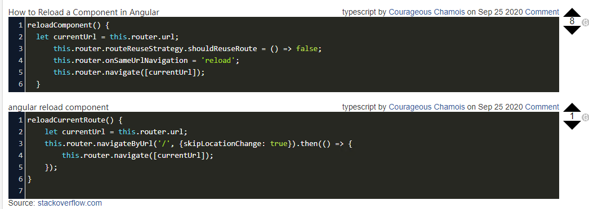

# Angular学习总结

Angular和react，vue相似，都是轻量级框架。

组件库网站：https://material.angular.cn/

ag-grid网格框架：https://www.ag-grid.com/angular-data-grid/

第三方依赖包：npmjs.com

## 环境

### 创建工程指令

Angular CLI 工具包 + Node.js（类似java的JDK）

安装angular CLI: `npm i @angular/cli -g` (-g为全局，加版本的话后面+@x.x←版本号，安装后可使用ng指令)
**优先使用命令创建，使用scss。**

查看版本：ng --version

help: ng help

创建：ng new xxxx

serve: ng serve

加入material
ng add @angular/material

**P.S.**
`无法加载文件 ...\npm\ng.ps1，因为在此系统上禁止运行脚本。`
PowerShell 执行策略禁止了运行未签名的脚本:
- 以管理员身份运行PowerShell。
- 输入set-executionpolicy remotesigned，选择Y。

### 查看工程

**.vscode文件** 配置文件

**node_module** 包文件（依赖包）

**brower** 浏览器支持

**editorconfig** 代码格式支持

**angular.json** 配置文件

**package.json** 装的包（很重要）唯一支持外部交互的文件

**package-lock.json** 版本

**.gitignore git** 不被git检测到的文件配置

### 使用ESLint和Prettier配置Angular项目

ESLint:

```
ng add @angular-eslint/schematics
```

Prettier:

```
npm install prettier --save-dev
```

之后创建一个 `.prettierrc.json` 文件并写入一些常见的配置。

再创建`prettierignore` 文件，把 `gitignore` 文件的内容复制过去。

**将ESLint和Prettier结合**

```text
npm install --save-dev eslint-config-prettier
npm install --save-dev eslint-plugin-prettier 
```

之后把 `plugin:prettier/recommended` 添加在 `.eslintrc.json` 中 extends 数组的最后。

```text
{
  "extends": ["plugin:prettier/recommended"]
}
```

再运行 `ng lint --fix` ，Prettier 的规则也会被执行并且自动 fix。

参考：https://zhuanlan.zhihu.com/p/472919853

### 启动服务

package.json 文件里：

start为启动 ng server --port 4300 ← 任意端口

devDependences 开发版本 npm -i xxx --save-dev

dependences 运行版本

## 开发

### src文件夹内介绍

assets 资源文件

enviroment 环境文件

...ico 网站图标

index.html 主页

polyfill.js 兼容

style.css 基础样式文件

test.js 单元测试启动

### src-app 开发主文件夹介绍

html scss ts 重要三文件 

有可能会有service

## 基础组件 & 元素 & 语法

### 元素

module：模块

component：组件

router：路由

- 负责页面跳转

pipe：管道

- 对字符串做一些特定的处理，一般用来改变内容的格式
- 给数据增加表现形式
- （差值表达式）{{xxx|json}} {{xxx|async}} 自带管道，转json和等待。

directive：指令

- 改属性，扩容
- 增加共通功能

service：服务
- 数据处理，前后台交互，数据清理

### 引入模块和服务（module.ts 文件）

模块：`import [……]` 

服务：`providers [……]` 

默认启动组件：`bootstrap [APPComponent]` 

### index.html

组件头：`<app-root></app-root>`

### 路由

为配置路径，设置页面跳转用。

loadChildren then 为惰性加载，预加载。

`Router=[{ path: 'xxx', component: xxx, children[{}] }];`

两种方式：隐式路由，路由跳转。隐式路由为不管怎么切换，url都保持不变。

### 异步路由

```typescript
const appRouter=[
	{
		path:'',
		loadChildren:'app/home/home.module'
	},{
		path:'home',
		loadChildren:'app/home/home.module'
	},{
		path:'user',
		loadChildren:'app/home/user.module'
	},{
		path:'role',
		loadChildren:'app/home/role.module'
	}
];
```

### 依赖注入

`constructor(private router: Router) {}`

### 路由守卫

判断是否有认证。例如登录认证，权限认证。

## 组件的写法和基础语法

### 生命周期

写法为在class xxxx implements 后面。

eg: `class xxxx implements OnInit, AfterContextInit {}`

angular生命周期为：

OnChanges：当数据绑定输入属性的参数改变的时候调用。
OnInit：在angular第一次显示数据绑定和设置指令/组件的输入属性之后，初始化指令/组件。
DoCheck：自定义的方法，用于检测和处理值的改变。
AfterContentInit：在组件内容初始化之后调用。
AfterContentChecked：组件每次检查内容时调用。
AfterViewInit： 组件相应的视图初始化之后调用。
AfterViewChecked：组件每次检查视图时调用。
OnDestroy：指令销毁前调用。

其中经常调用的，画面加载速度从快至慢为：OnInit，AfterContextInit，AfterViewInit。

**如果页面加载错误，且使用的onInit的话，可以试一下AfterViewInit。**

### 双向绑定

语法：

`[]` 变量 也是单向绑定

`( )` 方法

`[( )]` 双向绑定 

`{{ }}` 差值表达式。把变值/逻辑显示出来

双向绑定含指令: `<input [(ngModel)]="inputStr" type... >`  

### 循环，判断

`ngFor`  为forEach

- eg：`<app-xxx ngFor="let aaa of aaas" [aaa]='aaa'>`

`ngIf` 为Boolean表达式

`ngSwitch` 为switch case表达式

### 通过service传值

A.ts

```typescript
constructor(
  private service: Service,
) { }

this.preparationService.xxxx = this.xxxxxxx;
```

service.ts

```typescript
export class Service{
  xxxx: type;
}
```

B.ts

```typescript
constructor(
  private service: Service,
) { }

this.xxxx = this.preparationService.xxx;
```

### @Input 组件之间传值

子组件.ts 里：

`@Input inputParam: any`

- 加一个Input装饰器，为了可以让父组件给其提供值。
- 可以在构造函数里，给`inputParam`赋值。

`@output inputParamChange ...;`

子组件.html 里：

`<input matInput [ngModel]="currentDate" />`

父组件.html 里调用时：

`<xxx-Component [(inputParam)]="inputParamInParentCom"></>`

- sxxx-Component 为子组件的@Component里selector的名字。
- `inputParam` 为调用的子组件的属性（属性绑定）。
- 父组件.ts里，定义`inputParamInParentCom`的值。

跑fun()：`emit();`

### @ViewChild

①在ts里使用html的值

- html里：#xxx变量

- ts里：@ViewChild('xxx') xxx: any;

之后就可以使用xxx在html里面的属性了，例如：this.xxx.disabled

②**父组件把子组件的东西拿过来用。**

- 整个component：通过class名称，@ViewChild(TodoComponent) private todoList: TodoComponent; 然后就可以调用子组件里的方法了。
- 变量：子组件中构造器中接收的Service，一些非private变量。
- DOM：直接获取子组件HTML页面中的DOM，该DOM需要#命名
  - component.html 里：`<mat-sidenav #sidenav>`
  - component.ts 里`@ViewChild('sidenav') sidenav!: MatSidenav;`
- 指令：添加exportAs属性。

注意：@ViewChild和@ViewChildren会在父组件钩子方法 `ngAfterViewInit()` 调用之前赋值。

### BehaviorSubject

BehaviorSubject存储着最后发出给obsever的值。

例子：

```typescript
var subject = new Rx.BehaviorSubject(0);

subject.subscribe({
	next:(v) => console.log('observerA:' + v);
});

subject.next(1);
subject.next(2); // 发出2并存储2

subject.subscribe({
	next:(v) => console.log('observerB:' + v);
});

subject.next(3);
```

输出如下：

```txt
observerA: 0
observerA: 1
observerA: 2
observerB: 2
observerA: 3
observerB: 3
```

### Reload

How to reload a component in Angular



## 前后台服务交互

HttpClient注入之后，可以写post，get请求

eg:

```typescript
constructor(private http: HttpClient) {}

fun() {
    this.http.post(WebapiUrl.xxxxxx, xxxxxxxxxxx);
    
    // const url....
    this.http.get(url);
}

```

### 拦载器

处理API请求的统一的处理

HttpInterceptor

## AG-Grid

### 常用属性例子

```html
<ag-grid-angular
  class="ag-grid"
  #tableItemGrid
  [gridOptions]="gridOptions"
  [columnDefs]="columnDefs"
  [rowData]="rowData"
  [components]="components"
  [singleClickEdit]="true"
  [stopEditingWhenCellsLoseFocus]="true"
  [suppressRowClickSelection]="true"
  (selectionChanged)="onSelectionChange()"
  (gridSizeChanged)="onGridSizeChanged()"
  (rowSelected)="onRowSelected($event)"
  (rowDataChanged)="onRowDataChanged()"
  (sortChanged)="onSortChanged()"
  rowSelection="multiple"
>
</ag-grid-angular>
```

文本框过滤器属性

```typescript
getQuickFilterText: () => '',
```

### gridOptions

`gridOptions` 里为表格的详细信息。

`gridOptions.columnDefs` 里是列的定义的数据。

`gridOptions.components` 里是引用的所有自定义组件。

`gridOptions.api?.getColumnDefs());` 或 `gridOptions.columnApi?.getColumnState());` 可以get到状态，同时也有set方法，resetColumnState方法。

`gridOptions.rowData` 里是所有行的数据，为一个array。

`gridOptions.api` 支持一些改动操作。具体看[官方文档](https://www.ag-grid.com/javascript-data-grid/grid-api/)。

### Cell Editor & Cell Render

#### 生命周期

- 组件实例化
- `agInit()` 被调用一次 (提供相应的单元格参数param).
- 组件的 GUI 将被插入网格 0 或 1 次（组件可能首先被破坏）
- `refresh()` 被调用 0...n 次（即它可能永远不会被调用，或者被调用多次）。
- 组件被销毁一次。

换句话说，组件实例化`agInit()`和销毁总是只调用一次。除非组件首先被销毁，否则组件的 GUI 通常会被渲染一次。`refresh()`可以选择多次调用。

### ts语法

