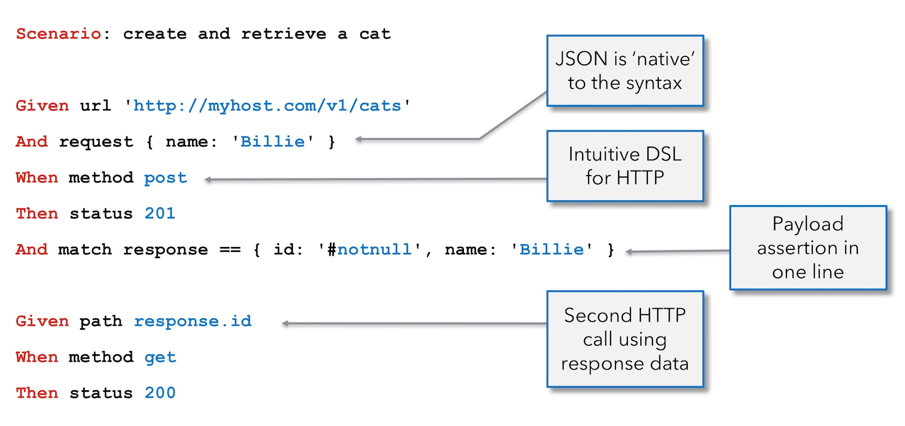

# Karate学习总结


## 语法



### Feature

```cucumber
Feature： [...]
    scenario:
    · ...
    · ...
```

### Background

...skip

### Scenario

create and retrieve a cat

为Feature里每一个具体的scenario


### 模板

```cucumber
@baseChat @ @
Feature: [/]
  scenario：
  ・xxxxxxxxxxxxxxx。
  
  Background:
    * configure headers = auth
    
  Scenario: xxxxxxxxxxxx。

    * print "(1) xxxxxxxx。"

    * def requestJson =
      """
        {
          "" : ""
        }
      """
      
    Given url baseUrl + '' + 
    And request requestJson
    When method post
    Then status 200
    And match response.key contains '#present'
    
@ignore @report=false @parts=get
Scenario: xxxxxxxx。

  * def requestJsonData =
    """
      {
        "": ""
      }
    """
    
  Given url baseUrl + '//' + __arg.key + '/'
  And request requestJsonData
  When method get
```

 

## Setting and Using Variables

### def

def为定义(变量)，可以接受json, xml等数据源

```cucumber
# * 可以代替Given, When, Then
* def sampleJson = 
"""
{
    a: "",
    b: ""
}
"""

Given url baseUrl + '...'
# And request接json，为body
And request sampleJson
When method post
Then status 200
And match response contains sampleJson
```

### assert

断言，判断表达式是否是true（注意比较num大小只能用Then assert）

```cucumber
Given def color = 'red'
And def num = 5
Then assert color + num == 'red 5'
```

### print

print到控制台，可以逗号分隔多个表达式。

当使用逗号，而不是连字符“+”的话，会有pretty-print。

```cucumber
* def sampleJson = { foo: ‘bar’, baz: [1, 2, 3] }
* print 'the value of sampleJson is: ', sampleJson
```

result:

```cucumber
[print]the value of sampleJson is: {
    "foo": "bar",
    "baz": [
        1,
        2,
        3
    ]
}
```

 

## 表达式

| Example                                         | Shape                  | Description                                                  |
| ----------------------------------------------- | ---------------------- | ------------------------------------------------------------ |
| `* def foo = 'bar'`                             | JS                     | strings, number, boolean                                     |
| `* def foo = 'bar' + baz[0]`                    | JS                     | 任何有效的 js 表达式, 变量,都可以混入。例: `bar.length + 1`  |
| `* def foo = { bar: '#(baz)' }`                 | JSON                   | 以 `{` or `[` 开头为json , 如果想抑制，使用 [`text`](#text) 代替 [`def`](#def) |
| `* def foo = ({ bar: baz })`                    | JS                     | 封闭的js                                                     |
| `* def foo = <foo>bar</foo>`                    | XML                    | 以 `<` 开头 为 XML, 如果想抑制，使用 [`text`](#text) 代替 [`def`](#def) |
| `* def foo = function(arg){ return arg + bar }` | JS Fn                  | 以 `function(...){` 开头 为 JS 函数                          |
| `* def foo = read('bar.json')`                  | JS                     | 使用内置`read()`函数                                         |
| `* def foo = $.bar[0]`                          | JsonPath               | short-cut JsonPath on the [`response`](#response)            |
| `* def foo = /bar/baz`                          | XPath                  | short-cut XPath on the [`response`](#response)               |
| `* def foo = get bar $..baz[?(@.ban)]`          | [`get`](#get) JsonPath | [JsonPath](https://github.com/json-path/JsonPath#path-examples) on the variable `bar`, you can also use [`get[0\]`](#get-plus-index) to get the first item if the JsonPath evaluates to an array - especially useful when using wildcards such as `[*]` or [filter-criteria](#jsonpath-filters)<br />* def responseXX = karate.jsonPath(response, "$.[?(@.key == '" + key + "')]")  然后使用responseXX[0].xxxx，记住responseXX 为数组，需要[0]<br />* def responseXX = get[0] response[?(@.XX=='xxxxx')].key 这里的get[0]同理 |
| `* def foo = $bar..baz[?(@.ban)]`               | $var.JsonPath          | [convenience short-cut](#get-short-cut) for the above        |
| `* def foo = get bar count(/baz//ban)`          | [`get`](#get) XPath    | `bar`变量的XPath                                             |
| `* def foo = karate.pretty(bar)`                | JS                     | 在js表达式中使用karate对象                                   |
| `* def Foo = Java.type('com.mycompany.Foo')`    | JS-Java                | [Java Interop](#java-interop), and even package-name-spaced one-liners like `java.lang.System.currentTimeMillis()` are possible |
| `* def foo = call bar { baz: '#(ban)' }`        | [`call`](#call)        | or [`callonce`](#callonce), where expressions like [`read('foo.js')`](#reading-files) are allowed as the object to be called or the argument |
| `* def foo = bar({ baz: ban })`                 | JS                     | equivalent to the above, JavaScript function invocation      |

 

## KeyWord

```cucumber
url`, `path`, `request`, `method` ,`status
```

### url

```cucumber
Given url 'https://...'
```

### path

```cucumber
Given path 'documents', documentId, 'download'

# 分开写法：
Given path 'documents'
And path documentId
And path 'download'
```

### request

In-line JSON:

```cucumber
Given request { name: 'Billie', type: 'LOL' }
```

In-line XML:

```cucumber
And request <cat><name>Billie</name><type>Ceiling</type></cat>
```

同包文件， Use the `classpath:` prefix to load from the classpath instead.

```cucumber
Given request read('my-json.json')
```

变量：

```cucumber
And request sampleVariable
```

### method

HTTP verb - `get`, `post`, `put`, `delete`, `patch`, `options`, `head`, `connect`, `trace`.

```cucumber
When method post
```

### status

HTTP响应

```cucumber
Then status 200
```


## 设置key-value pair的keyword

`param`, `header`, `cookie`, `form field`, `multipart field`.

该语法将在键和值之间包含一个“=”符号。 键不应在引号内。

### param

string param:

```cucumber
Given param someKey = 'hello'
And param anotherKey = someVariable
```

### header

一般函数或表达式：

```cucumber
Given header Authorization = myAuthFunction()
And header transaction-id = 'test-' + myIdString
```

常见的需求一般为为每个请求发送相同的header。

使用（Json）configure headers，可以为所有后置请求设置一次。

如果在 `Background:` 部分执行此操作，它将适用于 当前`*.feature` 文件中的所有 `Scenario:` 部分。

```cucumber
* configure headers = { 'Content-Type': 'application/xml' }
* configure headers = authorization
```

### cookie

设置cookie:

```cucumber
Given cookie foo = 'bar'
```

### form field

当提交 HTTP 请求时，HTML 表单字段将被 URL 编码。

`Content-Type` header 将自动设置为：`application/x-www-form-urlencoded`。

```cucumber
Given path 'login'
And form field username = 'john'
And form field password = 'secret'
When method post
Then status 200
And def authToken = response.token
```

设置多值：（例如：用于模拟复选框和多选）

```cucumber
* form field selected = ['apple', 'orange']
```

### multipart field

...skip

### multipart file

...skip

### multipart entity

...skip


## 多参数keyword

```cucumber
params`, `headers`, `cookies`, `form fields`, `multipart fields`, `multipart files
```

### params

```cucumber
* params { searchBy: 'client', active: true, someList: [1, 2, 3] }
```

### headers

```cucumber
* def someData = { Authorization: 'sometoken', tx_id: '1234', extraTokens: ['abc', 'def'] }
* headers someData
```

### cookies

```cucumber
* cookies { someKey: 'someValue', foo: 'bar' }
```

### form fields

```cucumber
* def credentials = { username: '#(user.name)', password: 'secret', projects: ['one', 'two'] }
* form fields credentials
```


## Configure

### Managing Headers, SSL, Timeouts and HTTP Proxy

| Key                        | Type               | Description                                                  |
| -------------------------- | ------------------ | ------------------------------------------------------------ |
| `headers`                  | JSON / JS function | See `configure headers`                                      |
| `cookies`                  | JSON / JS function | Just like `configure headers`, but for cookies. You will typically never use this, as response cookies are auto-added to all future requests. If you need to clear cookies at any time, just do `configure cookies = null` |
| `logPrettyRequest`         | boolean            | Pretty print the request payload JSON or XML with indenting (default `false`) |
| `logPrettyResponse`        | boolean            | Pretty print the response payload JSON or XML with indenting (default `false`) |
| `printEnabled`             | boolean            | Can be used to suppress the `print` output when not in 'dev mode' by setting as `false` (default `true`) |
| `report`                   | JSON / boolean     | see report verbosity                                         |
| `afterScenario`            | JS function        | Will be called after every `Scenario` (or `Example` within a `Scenario Outline`), refer to this example: `hooks.feature` |
| `afterFeature`             | JS function        | Will be called after every `Feature`, refer to this example: `hooks.feature` |
| `ssl`                      | boolean            | Enable HTTPS calls without needing to configure a trusted certificate or key-store. |
| `ssl`                      | string             | Like above, but force the SSL algorithm to one of [these values](http://docs.oracle.com/javase/8/docs/technotes/guides/security/StandardNames.html#SSLContext). (The above form internally defaults to `TLS` if simply set to `true`). |
| `ssl`                      | JSON               | see X509 certificate authentication                          |
| `followRedirects`          | boolean            | Whether the HTTP client automatically follows redirects - (default `true`), refer to this example. |
| `connectTimeout`           | integer            | Set the connect timeout (milliseconds). The default is 30000 (30 seconds). Note that for `karate-apache`, this sets the [socket timeout](https://stackoverflow.com/a/22722260/143475) to the same value as well. |
| `readTimeout`              | integer            | Set the read timeout (milliseconds). The default is 30000 (30 seconds). |
| `proxy`                    | string             | Set the URI of the HTTP proxy to use.                        |
| `proxy`                    | JSON               | For a proxy that requires authentication, set the `uri`, `username` and `password`, see example below. Also a `nonProxyHosts` key is supported which can take a list for e.g. `{ uri: '``http://my.proxy.host:8080'``, nonProxyHosts: ['host1', 'host2']}` |
| `localAddress`             | string             | see `karate-gatling`                                         |
| `charset`                  | string             | The charset that will be sent in the request `Content-Type` which defaults to `utf-8`. You typically never need to change this, and you can over-ride (or disable) this per-request if needed via the `header` keyword (example). |
| `retry`                    | JSON               | defaults to `{ count: 3, interval: 3000 }` - see `retry until` |
| `callSingleCache`          | JSON               | defaults to `{ minutes: 0, dir: 'target' }` - see `configure callSingleCache` |
| `lowerCaseResponseHeaders` | boolean            | Converts every key in the `responseHeaders` to lower-case which makes it easier to validate or re-use |
| `abortedStepsShouldPass`   | boolean            | defaults to `false`, whether steps after a `karate.abort()` should be marked as `PASSED` instead of `SKIPPED` - this can impact the behavior of 3rd-party reports, see [this issue](https://github.com/intuit/karate/issues/755) for details |
| `logModifier`              | Java Object        | See Log Masking                                              |
| `responseHeaders`          | JSON / JS function | See `karate-netty`                                           |
| `cors`                     | boolean            | See `karate-netty`                                           |
| `driver`                   | JSON               | See UI Automation                                            |
| `driverTarget`             | JSON / Java Object | See `configure driverTarget`                                 |
| `pauseIfNotPerf`           | boolean            | defaults to `false`, relevant only for performance-testing, see `karate.pause()` and `karate-gatling` |
| `xmlNamespaceAware`        | boolean            | defaults to `false`, to handle XML namespaces in [some special circumstances](https://github.com/karatelabs/karate/issues/1587) |
| `abortSuiteOnFailure`      | boolean            | defaults to `false`, to not attempt to run any more tests upon a failure |

Examples:

```cucumber
# pretty print the response payload
* configure logPrettyResponse = true

# enable ssl (and no certificate is required)
* configure ssl = true

# enable ssl and force the algorithm to TLSv1.2
* configure ssl = 'TLSv1.2'

# time-out if the response is not received within 10 seconds (after the connection is established)
* configure readTimeout = 10000

# set the uri of the http proxy server to use
* configure proxy = 'http://my.proxy.host:8080'

# proxy which needs authentication
* configure proxy = { uri: 'http://my.proxy.host:8080', username: 'john', password: 'secret' }
```

 

## Payload Assertions 负载断言

### match

断言 Payload Assertions / Smart Comparison

### set

设置值

### JSON e.g.

```cucumber
* def myJson = { foo: 'bar' }
* set myJson.foo = 'world'
* match myJson == { foo: 'world' }

# add new keys.  you can use pure JsonPath expressions (notice how this is different from the above)
* set myJson $.hey = 'ho'
* match myJson == { foo: 'world', hey: 'ho' }

# and even append to json arrays (or create them automatically)
* set myJson.zee[0] = 5
* match myJson == { foo: 'world', hey: 'ho', zee: [5] }

# omit the array index to append
* set myJson.zee[] = 6
* match myJson == { foo: 'world', hey: 'ho', zee: [5, 6] }

# nested json ? no problem
* set myJson.cat = { name: 'Billie' }
* match myJson == { foo: 'world', hey: 'ho', zee: [5, 6], cat: { name: 'Billie' } }

# and for match - the order of keys does not matter
* match myJson == { cat: { name: 'Billie' }, hey: 'ho', foo: 'world', zee: [5, 6] }

# you can ignore fields marked with '#ignore'
* match myJson == { cat: '#ignore', hey: 'ho', foo: 'world', zee: [5, 6] }
```

### XML & XPath e.g.

```cucumber
* def cat = <cat><name>Billie</name></cat>
* set cat /cat/name = 'Jean'
* match cat / == <cat><name>Jean</name></cat>

# you can even set whole fragments of xml
* def xml = <foo><bar>baz</bar></foo>
* set xml/foo/bar = <hello>world</hello>
* match xml == <foo><bar><hello>world</hello></bar></foo>
```

### remove

删除 （JSON）

```cucumber
* def json = { foo: 'world', hey: 'ho', zee: [1, 2, 3] }
* remove json.hey
* match json == { foo: 'world', zee: [1, 2, 3] }
* remove json $.zee[1]
* match json == { foo: 'world', zee: [1, 3] }
```

删除 （XML ）

```cucumber
* def xml = <foo><bar><hello>world</hello></bar></foo>
* remove xml/foo/bar/hello
* match xml == <foo><bar/></foo>
* remove xml /foo/bar
* match xml == <foo/>
```

### delete

```cucumber
* def key = 'a'
* def foo = { a: 1 }
* eval delete foo[key]
```

省略eval

```cucumber
* delete foo[key]
```


## Ignore or Validate

The supported markers are the following:

| Marker        | Description                                                  |
| ------------- | ------------------------------------------------------------ |
| `#ignore`     | 即使存在数据元素或 JSON 键，也跳过此字段的比较               |
| `#null`       | 期望实际值为“null”，并且数据元素或 JSON 键存在               |
| `#notnull`    | 期望实际值不是-`null`                                        |
| `#present`    | 实际值可以是任何类型或 `null`，但键必须存在（仅适用于 JSON / XML） |
| `#notpresent` | 期望密钥不存在（仅适用于 JSON / XML）                        |
| `#array`      | 期望实际值为 JSON 数组                                       |
| `#object`     | 期望实际值为 JSON 对象                                       |
| `#boolean`    | 期望实际值为 boolean `true` or `false`                       |
| `#number`     | 期望实际值为 number                                          |
| `#string`     | 期望实际值为 string                                          |
| `#uuid`       | 期望实际值 (string) 符合 UUID format                         |
| `#regex STR`  | 期望实际值 (string) 与正则表达式“STR”匹配                    |
| `#? EXPR`     | 期望JS表达式“EXPR”计算为true                                 |
| `#[NUM] EXPR` | 高级数组验证                                                 |
| `#(EXPR)`     | embedded expressions 嵌入表达式                              |

 

## 匹配 JSON 键和数组的子集

### match contains

```cucumber
* def foo = { bar: 1, baz: 'hello', ban: 'world' }

* match foo contains { bar: 1 }
* match foo contains { baz: 'hello' }
* match foo contains { bar:1, baz: 'hello' }
# this will fail
# * match foo == { bar:1, baz: 'hello' }
```

### (not) !contains

```cucumber
* def foo = { bar: 1, baz: 'hello', ban: 'world' }
* match foo !contains { bar: 2 }
* match foo !contains { huh: '#notnull' }
```

### match contains only

乱序情况：

```cucumber
* def data = { foo: [1, 2, 3] }
* match data.foo contains 1
* match data.foo contains [2]
* match data.foo contains [3, 2]
* match data.foo contains only [3, 2, 1]
* match data.foo contains only [2, 3, 1]
# this will fail
# * match data.foo contains only [2, 3]
```

### match contains any

断言任何给定的元素都存在

```cucumber
* def data = { foo: [1, 2, 3] }
* match data.foo contains any [9, 2, 8]
* def data = { a: 1, b: 'x' }
* match data contains any { b: 'x', c: true }
```

### match contains deep

深度包含

```cucumber
Scenario: recurse nested json
  * def original = { a: 1, b: 2, c: 3, d: { a: 1, b: 2 } }
  * def expected = { a: 1, c: 3, d: { b: 2 } }
  * match original contains deep expected

Scenario: recurse nested array
  * def original = { a: 1, arr: [ { b: 2, c: 3 }, { b: 3, c: 4 } ] }
  * def expected = { a: 1, arr: [ { b: 2 }, { c: 4 } ] }
  * match original contains deep expected
```

### 快捷符号

| Symbol | Means           |
| ------ | --------------- |
| `^`    | `contains`      |
| `^^`   | `contains only` |
| `^*`   | `contains any`  |
| `^+`   | `contains deep` |
| `!^`   | `not contains`  |


## Get

```cucumber
* def cat = 
  """
  {
    name: 'Billie',
    kittens: [
      { id: 23, name: 'Bob' },
      { id: 42, name: 'Wild' }
    ]
  }
  """
* def kitnums = get cat.kittens[*].id
* match kitnums == [23, 42]
* def kitnames = get cat $.kittens[*].name
* match kitnames == ['Bob', 'Wild']
```


## Loops

karate.repeat() 循环

karate.range() 添加范围

```cucumber
* def fun = function(i){ return i * 2 }
* def foo = karate.repeat(5, fun)
* match foo == [0, 2, 4, 6, 8]

* def foo = []
* def fun = function(i){ karate.appendTo(foo, i) }
* karate.repeat(5, fun)
* match foo == [0, 1, 2, 3, 4]

# generate test data easily
* def fun = function(i){ return { name: 'User ' + (i + 1) } }
* def foo = karate.repeat(3, fun)
* match foo == [{ name: 'User 1' }, { name: 'User 2' }, { name: 'User 3' }]

# generate a range of numbers as a json array
* def foo = karate.range(4, 9)
* match foo == [4, 5, 6, 7, 8, 9]
```


## Special Variables

内置变量。都有HTTP响应的权限。

### response

在每次 HTTP 调用之后，这个变量被设置为response body，并且在下一个 HTTP 请求覆盖它之前一直可用。

在使用 `JsonPath` 表达式时，`$` 代表 `response`。

```cucumber
# the three lines below are equivalent
Then match response $ == { name: 'A' }
Then match response == { name: 'A' }
Then match $ == { name: 'A' }

# the three lines below are equivalent
Then match response.name == 'A'
Then match response $.name == 'A'
Then match $.name == 'A'
```

在使用 `XML` 和 `XPath` 表达式时，`/` 代表 `response`。

```cucumber
# the four lines below are equivalent
Then match response / == <cat><name>A</name></cat>
Then match response/ == <cat><name>A</name></cat>
Then match response == <cat><name>A</name></cat>
Then match / == <cat><name>A</name></cat> 

# the three lines below are equivalent
Then match response /cat/name == 'A'
Then match response/cat/name == 'A'
Then match /cat/name == 'A'
```

### responseBytes

将响应的内容保存为字节数。

### responseCookies

```cucumber
* assert responseCookies['my.key'].value == 'someValue'

# karate's unified data handling means that even 'match' works
* match responseCookies contains { time: '#notnull' }

# ... which means that checking if a cookie does NOT exist is a piece of cake
* match responseCookies !contains { blah: '#notnull' }

# save a response cookie for later use
* def time = responseCookies.time.value
```

### responseHeaders

```
* def contentType = responseHeaders['Content-Type'][0]
```

`karate.response.header(name)` 可以更简单地按名称获取标头值字符串，并且它将忽略作为参数传递的名称的大小写。

```
* match karate.response.header('content-type') == 'application/json'
```

### responseStatus

通常使用status关键字即可。如若需要获取HTTP response code以便以后使用:

```cucumber
* def uploadStatusCode = responseStatus

# check if the response status is either of two values
Then assert responseStatus == 200 || responseStatus == 204
```

### responseTime

```cucumber
When method post
Then status 201
And assert responseTime < 1000
```

### responseType

...skip

### requestTimeStamp

...skip

## karate object

| Operation                                                    | Description                                                  |
| ------------------------------------------------------------ | ------------------------------------------------------------ |
| <a name="karate-abort"><code>karate.abort()</code></a>       | 可以结合使用条件逻辑`* if (condition) karate.abort()`提前退出 `Scenario` |
| <a name="karate-append"><code>karate.append(... items)</code></a> | 从项目/列表中创建列表                                        |
| <a name="karate-appendto"><code>karate.appendTo(name, ... items)</code></a> | useful to append to a list-like variable (that has to exist) in scope, see [JSON transforms](#json-transforms) - the first argument can be a reference to an array-like variable or even the name (string) of an existing variable which is list-like |
| <a name="karate-compareimage"><code>karate.compareImage(baseline, latest, [options])</code></a> | compare two images the same way that [`compareImage`](#compare-image) works (with an optional `options` argument), returns an object with the following keys: `baseline`, `latest`, `mismatchPercentage`, `engine`, `failureThreshold` and optionally: `error`, `isBaselineMissing`, `isScaleMismatch`, `isMismatch`, `resembleMismatchPercentage`, `ssimMismatchPercentage` |
| <a name="karate-call"><code>karate.call(fileName, [arg])</code></a> | invoke a [`*.feature` file](#calling-other-feature-files) or a [JavaScript function](#calling-javascript-functions) the same way that [`call`](#call) works (with an optional solitary argument), see [`call()` vs `read()`](#call-vs-read) for details |
| <a name="karate-callsingle"><code>karate.callSingle(fileName, [arg])</code></a> | like the above, but guaranteed to run **only once** even across multiple features - see [`karate.callSingle()`](#karatecallsingle) |
| <a name="karate-configure"><code>karate.configure(key, value)</code></a> | does the same thing as the [`configure`](#configure) keyword, and a very useful example is to do `karate.configure('connectTimeout', 5000);` in [`karate-config.js`](#configuration) - which has the 'global' effect of not wasting time if a connection cannot be established within 5 seconds |
| <a name="karate-distinct"><code>karate.distinct(list)</code></a> | returns only unique items out of an array of strings or numbers |
| <a name="karate-doc"><code>karate.doc(arg)</code></a>        | just like [`karate.render()`](#karate-render) but will insert the HTML into the report |
| <a name="karate-embed"><code>karate.embed(object, mimeType)</code></a> | embeds the object (can be raw bytes or an image) into the JSON report output, see this [example](karate-demo/src/test/java/demo/embed/embed.feature) |
| <a name="karate-env"><code>karate.env</code></a>             | gets the value (read-only) of the environment property 'karate.env', and this is typically used for bootstrapping [configuration](#configuration) |
| <a name="karate-eval"><code>karate.eval(expression)</code></a> | for really advanced needs, you can programmatically generate a snippet of JavaScript which can be evaluated at run-time, you can find an example [here](karate-junit4/src/test/java/com/intuit/karate/junit4/demos/js-arrays.feature) |
| <a name="karate-exec"><code>karate.exec(command)</code></a>  | convenient way to execute an OS specific command and return the console output e.g. `karate.exec('some.exe -h')` (or `karate.exec(['some.exe', '-h'])`) useful for calling non-Java code (that can even return data) or for starting user-interfaces to be automated, this command will block until the process terminates, also see [`karate.fork()`](#karate-fork) |
| <a name="karate-extract"><code>karate.extract(text, regex, group)</code></a> | useful to "scrape" text out of non-JSON or non-XML text sources such as HTML, `group` follows the Java [regex rules](https://docs.oracle.com/javase/7/docs/api/java/util/regex/Pattern.html), see [this example](karate-core/src/test/java/com/intuit/karate/core/extract.feature) |
| <a name="karate-extractall"><code>karate.extractAll(text, regex, group)</code></a> | like the above, but returns a list of text-matches           |
| <a name="karate-fail"><code>karate.fail(message)</code></a>  | if you want to conditionally stop a test with a descriptive error message, e.g. `* if (condition) karate.fail('we expected something else')` |
| <a name="karate-feature"><code>karate.feature</code></a>     | get metadata about the currently executing feature within a test |
| <a name="karate-filter"><code>karate.filter(list, predicate)</code></a> | functional-style 'filter' operation useful to filter list-like objects (e.g. JSON arrays), see [example](karate-junit4/src/test/java/com/intuit/karate/junit4/demos/js-arrays.feature), the second argument has to be a JS function (item, [index]) that returns a `boolean` |
| <a name="karate-filterkeys"><code>karate.filterKeys(map, keys)</code></a> | extracts a sub-set of key-value pairs from the first argument, the second argument can be a list (or varargs) of keys - or even another JSON where only the keys would be used for extraction, [example](karate-junit4/src/test/java/com/intuit/karate/junit4/demos/js-arrays.feature) |
| `karate.forEach(list, function)`                             | functional-style 'loop' operation useful to traverse list-like (or even map-like) objects (e.g. JSON / arrays), see [example](karate-junit4/src/test/java/com/intuit/karate/junit4/demos/js-arrays.feature), the second argument has to be a JS function (item, [index]) for lists and (key, [value], [index]) for JSON / maps |
| <a name="karate-fork"><code>karate.fork(map)</code></a>      | executes an OS command, but forks a process in parallel and will not block the test like [`karate.exec()`](#karate-exec) e.g. `karate.fork({ args: ['some.exe', '-h'] })` or `karate.fork(['some.exe', '-h'])` - you can use a composite string as `line` (or the solitary argument e.g. `karate.fork('some.exe -h')`) instead of `args`, and an optional `workingDir` string property and `env` JSON / map is also supported - this returns a [`Command`](karate-core/src/main/java/com/intuit/karate/shell/Command.java) object which has operations such as `waitSync()` and `close()` if you need more control, more details [here](https://stackoverflow.com/a/62911366/143475) |
| <a name="karate-fromstring"><code>karate.fromString(string)</code></a> | for advanced conditional logic for e.g. when a string coming from an external process is dynamic - and whether it is JSON or XML is not known in advance, see [example](karate-junit4/src/test/java/com/intuit/karate/junit4/demos/type-conv.feature) |
| <a name="karate-get"><code>karate.get(name, [default])</code></a> | get the value of a variable by name (or JsonPath expression), if not found - this returns `null` which is easier to handle in JavaScript (than `undefined`), and an optional (literal / constant) second argument can be used to return a "default" value, very useful to set variables in called features that have not been pre-defined<br />可认为成三元表达式。name一定要有【''】。eg：karate.get('num', 0) |
| <a name="karate-http"><code>karate.http(url)</code></a>      | returns a convenience [`Http`](karate-core/src/main/java/com/intuit/karate/Http.java) request builder class, only recommended for [advanced use](https://github.com/intuit/karate/tree/develop/examples/ui-test#webdriver-tips) |
| <a name="karate-jsonpath"><code>karate.jsonPath(json, expression)</code></a> | brings the power of [JsonPath](https://github.com/json-path/JsonPath) into JavaScript, and you can find an example [here](karate-junit4/src/test/java/com/intuit/karate/junit4/demos/js-arrays.feature). |
| <a name="karate-keysof"><code>karate.keysOf(object)</code></a> | returns only the keys of a map-like object                   |
| <a name="karate-log"><code>karate.log(... args)</code></a>   | log to the same logger (and log file) being used by the parent process, logging can be suppressed with [`configure printEnabled`](#configure) set to `false`, and just like [`print`](#print) - use comma-separated values to "pretty print" JSON or XML |
| <a name="karate-logger-debug"><code>karate.logger.debug(... args)</code></a> | access to the Karate logger directly and log in debug. Might be desirable instead of `karate.log` or `print` when looking to reduce the logs in console in your CI/CD pipeline but still retain the information for reports. See [Logging](#logging) for additional details. |
| <a name="karate-lowercase"><code>karate.lowerCase(object)</code></a> | useful to brute-force all keys and values in a JSON or XML payload to lower-case, useful in some cases, see [example](karate-junit4/src/test/java/com/intuit/karate/junit4/demos/lower-case.feature) |
| <a name="karate-map"><code>karate.map(list, function)</code></a> | functional-style 'map' operation useful to transform list-like objects (e.g. JSON arrays), see [example](karate-junit4/src/test/java/com/intuit/karate/junit4/demos/js-arrays.feature), the second argument has to be a JS function (item, [index]) |
| <a name="karate-mapwithkey"><code>karate.mapWithKey(list, string)</code></a> | convenient for the common case of transforming an array of primitives into an array of objects, see [JSON transforms](#json-transforms) |
| <a name="karate-match"><code>karate.match(actual, expected)</code></a> | brings the power of the *fuzzy* [`match`](#match) syntax into Karate-JS, returns a JSON in the form `{ pass: '#boolean', message: '#string' }` and you can find an example [here](karate-junit4/src/test/java/com/intuit/karate/junit4/demos/js-arrays.feature) - you can even place a *full* match expression like this: `karate.match("each foo contains { a: '#number' }")` |
| <a name="karate-merge"><code>karate.merge(... maps)</code></a> | useful to merge the key-values of two (or more) JSON (or map-like) objects, see [JSON transforms](#json-transforms) |
| <a name="karate-os"><code>karate.os</code></a>               | returns the operating system details as JSON, for e.g. `{ type: 'macosx', name: 'Mac OS X' }` - useful for writing conditional logic, the possible `type`-s being: `macosx`, `windows`, `linux` and `unknown` |
| <a name="karate-pause"><code>karate.pause(number)</code></a> | sleep time in milliseconds, relevant only for [performance-testing](karate-gatling#think-time) - and will be a no-op otherwise unless [`configure pauseIfNotPerf`](#configure) is `true` |
| <a name="karate-pretty"><code>karate.pretty(value)</code></a> | return a 'pretty-printed', nicely indented string representation of the JSON value, also see: [`print`](#print) |
| <a name="karate-prettyxml"><code>karate.prettyXml(value)</code></a> | return a 'pretty-printed', nicely indented string representation of the XML value, also see: [`print`](#print) |
| <a name="karate-prevrequest"><code>karate.prevRequest</code></a> | for advanced users, you can inspect the *actual* HTTP request after it happens, useful if you are writing a framework over Karate, refer to this example: [`request.feature`](karate-demo/src/test/java/demo/request/request.feature) |
| <a name="karate-properties"><code>karate.properties[key]</code></a> | get the value of any Java system-property by name, useful for [advanced custom configuration](#dynamic-port-numbers) |
| <a name="karate-range"><code>karate.range(start, end, [interval])</code></a> | returns a JSON array of integers (inclusive), the optional third argument must be a positive integer and defaults to 1, and if start < end the order of values is reversed |
| <a name="karate-read"><code>karate.read(filename)</code></a> | the same [`read()`](#reading-files) function - which is pre-defined even within JS blocks, so there is no need to ever do `karate.read()`, and just `read()` is sufficient |
| <a name="karate-readasbytes"><code>karate.readAsBytes(filename)</code></a> | rarely used, like [`karate.readAsString`](#karate-readasstring) - but returns a byte array |
| <a name="karate-readasstream"><code>karate.readAsStream(filename)</code></a> | rarely used, like [`karate.readAsString`](#karate-readasstring) - but returns a Java `InputStream` |
| <a name="karate-readasstring"><code>karate.readAsString(filename)</code></a> | [rarely used](#read-file-as-string), behaves exactly like [`read`](#reading-files) - but does *not* auto convert to JSON or XML |
| <a name="karate-remove"><code>karate.remove(name, path)</code></a> | very rarely used - when needing to perform conditional removal of JSON keys or XML nodes. Behaves the same way as the [`remove`](#remove) keyword. |
| <a name="karate-render"><code>karate.render(arg)</code></a>  | renders an HTML template, the `arg` can be a string (prefixable path to the HTML) or a JSON that takes either a `path` or `html` property, see [`doc`](#doc) |
| <a name="karate-repeat"><code>karate.repeat(count, function)</code></a> | useful for building an array with `count` items or doing something `count` times, refer this [example](karate-junit4/src/test/java/com/intuit/karate/junit4/demos/repeat.feature). Also see [loops](#loops). |
| <a name="karate-response"><code>karate.response</code></a>   | returns the last HTTP response as a JS object that enables advanced use-cases such as getting a header ignoring case: `karate.response.header('some-header')` |
| <a name="karate-request"><code>karate.request</code></a>     | returns the last HTTP request as a JS object that enables advanced use-cases such as getting a header ignoring case: `karate.request.header('some-header')`, which works [even in mocks](https://github.com/karatelabs/karate/tree/master/karate-netty#requestheaders) |
| <a name="karate-scenario"><code>karate.scenario</code></a>   | get metadata about the currently executing `Scenario` (or `Outline` - `Example`) within a test |
| <a name="karate-set"><code>karate.set(name, value)</code></a> | sets the value of a variable (immediately), which may be needed in case any other routines (such as the [configured headers](#configure-headers)) depend on that variable |
| <a name="karate-setall"><code>karate.set(object)</code></a>  | where the single argument is expected to be a `Map` or JSON-like, and will perform the above `karate.set()` operation for all key-value pairs in one-shot, see [example](karate-junit4/src/test/java/com/intuit/karate/junit4/demos/set.feature) |
| <a name="karate-setpath"><code>karate.set(name, path, value)</code></a> | only needed when you need to conditionally build payload elements, especially XML. This is best explained via [an example](karate-junit4/src/test/java/com/intuit/karate/junit4/xml/xml.feature#L211), and it behaves the same way as the [`set`](#set) keyword. Also see [`eval`](#eval). |
| <a name="karate-setxml"><code>karate.setXml(name, xmlString)</code></a> | rarely used, refer to the example above                      |
| <a name="karate-setup"><code>karate.setup([name])</code></a> | call a `Scenario` tagged with the built-in [`@setup`](#setup) annotation |
| <a name="karate-setuponce"><code>karate.setupOnce([name])</code></a> | like [`karate.setup()`](#karate-setup) above, but cache the result so that the "setup" runs only once |
| <a name="karate-signal"><code>karate.signal(result)</code></a> | trigger an event that [`karate.listen(timeout)`](#karate-listen) is waiting for, and pass the data, see [async](#async) |
| <a name="karate-sizeof"><code>karate.sizeOf(object)</code></a> | returns the size of the map-like or list-like object         |
| <a name="karate-sort"><code>karate.sort(list, function)</code></a> | sorts the list using the provided custom function called for each item in the list (and the optional second argument is the item index) e.g. `karate.sort(myList, x => x.val)`, and the second / function argument is not needed if the list is of plain strings or numbers |
| <a name="karate-start"><code>karate.start()</code></a>       | only for starting a mock from [within a test / feature file see mocks](karate-netty#within-a-karate-test) |
| <a name="karate-stop"><code>karate.stop(port)</code></a>     | will pause the test execution until a socket connection (even HTTP `GET`) is made to the port logged to the console, useful for troubleshooting UI tests without using a [de-bugger](https://twitter.com/KarateDSL/status/1167533484560142336), of course - *NEVER* forget to remove this after use ! |
| <a name="karate-target"><code>karate.target(object)</code></a> | currently for web-ui automation only, see [target lifecycle](karate-core#target-lifecycle) |
| <a name="karate-tags"><code>karate.tags</code></a>           | for advanced users - scripts can introspect the tags that apply to the current scope, refer to this example: [`tags.feature`](karate-junit4/src/test/java/com/intuit/karate/junit4/demos/tags.feature) |
| <a name="karate-tagvalues"><code>karate.tagValues</code></a> | for even more advanced users - Karate natively supports tags in a `@name=val1,val2` format, and there is an inheritance mechanism where `Scenario` level tags can over-ride `Feature` level tags, refer to this example: [`tags.feature`](karate-junit4/src/test/java/com/intuit/karate/junit4/demos/tags.feature) |
| <a name="karate-toabsolutepath"><code>karate.toAbsolutePath(relativePath)</code></a> | when you want to get the absolute OS path to the argument which could even have a prefix such as `classpath:`, e.g. `karate.toAbsolutePath('some.json')` |
| <a name="karate-tobean"><code>karate.toBean(json, className)</code></a> | converts a JSON string or map-like object into a Java object, given the Java class name as the second argument, refer to this [file](karate-junit4/src/test/java/com/intuit/karate/junit4/demos/type-conv.feature) for an example |
| <a name="karate-tocsv"><code>karate.toCsv(list)</code></a>   | converts a JSON array (of objects) or a list-like object into a CSV string, writing this to a file is your responsibility or you could use [`karate.write()`](#karate-write) |
| <a name="karate-tojava"><code>karate.toJava(function)</code></a> | rarely used, when you need to pass a JS function to custom Java code, typically for [Async](#async), and another edge case is to convert a JSON array or object to a Java `List` or `Map`, see [example](karate-core/src/test/java/com/intuit/karate/core/to-bean.feature) |
| <a name="karate-tojavafile"><code>karate.toJavaFile(path)</code></a> | in case you need a `java.io.File` instance to pass to Java interop, takes the [Karate prefixes](#reading-files) such as `classpath:` for convenience |
| <a name="karate-tojson"><code>karate.toJson(object)</code></a> | converts a Java object into JSON, and `karate.toJson(object, true)` will strip all keys that have `null` values from the resulting JSON, convenient for unit-testing Java code, see [example](karate-demo/src/test/java/demo/unit/cat.feature) |
| <a name="karate-typeof"><code>karate.typeOf(any)</code></a>  | for advanced conditional logic when object types are dynamic and not known in advance, see [example](karate-junit4/src/test/java/com/intuit/karate/junit4/demos/type-conv.feature) |
| <a name="karate-urldecode"><code>karate.urlDecode(string)</code></a> | URL decode                                                   |
| <a name="karate-urlencode"><code>karate.urlEncode(string)</code></a> | URL encode                                                   |
| <a name="karate-valuesof"><code>karate.valuesOf(object)</code></a> | returns only the values of a map-like object (or itself if a list-like object) |
| <a name="karate-waitforhttp"><code>karate.waitForHttp(url)</code></a> | will wait until the URL is ready to accept HTTP connections  |
| <a name="karate-waitforport"><code>karate.waitForPort(host, port)</code></a> | will wait until the host:port is ready to accept socket connections |
| <a name="karate-websocket"><code>karate.webSocket(url, handler)</code></a> | see [websocket](#websocket)                                  |
| <a name="karate-write"><code>karate.write(object, path)</code></a> | *normally not recommended, please [read this first](https://stackoverflow.com/a/54593057/143475)* - writes the bytes of `object` to a path which will *always* be relative to the "build" directory (typically `target`), see this example: [`embed-pdf.js`](karate-demo/src/test/java/demo/embed/embed-pdf.js) - and this method returns a `java.io.File` reference to the file created / written to |
| <a name="karate-xmlpath"><code>karate.xmlPath(xml, expression)</code></a> | Just like [`karate.jsonPath()`](#karate-jsonpath) - but for XML, and allows you to use dynamic XPath if needed, see [example](karate-junit4/src/test/java/com/intuit/karate/junit4/xml/xml.feature). |


## Call

### Calling other *.feature files

call read:

```cucumber
Feature: which makes a 'call' to another re-usable feature

Background:
  * configure headers = read('classpath:my-headers.js')
  * def signIn = call read('classpath:my-signin.feature') { username: 'john', password: 'secret' }
  * def authToken = signIn.authToken

Scenario: some scenario
  # main test steps
```

### Call Tag Selector

```cucumber
call read('classpath:my-signin.feature@name=someScenarioName')
```

### Call Same Feature

共通方法

@ignore @xxx

```cucumber
Scenario: one
* call read('@two')

@ignore @two
Scenario: two
* print 'called'
```

### Calling JavaScript Functions

```cucumber
* def adder = function(a, b){ return a + b }
* assert adder(1, 2) == 3
```

### call vs read()

| Code                                                         | Description                                                  |
| ------------------------------------------------------------ | ------------------------------------------------------------ |
| `* def login = read('login.feature')` `* call login`         | Shared Scope, and the `login` variable can be re-used        |
| `* call read('login.feature')`                               | short-cut for the above without needing a variable           |
| `* def credentials = read('credentials.json')` `* def login = read('login.feature')` `* call login credentials` | Note how using `read()` for a JSON file returns *data* - not "callable" code, and here it is used as the `call` argument |
| `* call read('login.feature') read('credentials.json')`      | You *can* do this in theory, but it is not as readable as the above |
| `* karate.call('login.feature')`                             | The JS API allows you to do this, but this will *not* be Shared Scope |
| `* def result = call read('login.feature')`                  | `call` result assigned to a variable and *not* Shared Scope  |
| `* def result = karate.call('login.feature')`                | exactly equivalent to the above !                            |
| `* if (cond) karate.call(true, 'login.feature')`             | if you need conditional logic *and* Shared Scope, add a boolean `true` first argument |
| `* def credentials = read('credentials.json')` `* def result = call read('login.feature') credentials` | like the above, but with a `call` argument                   |
| `* def credentials = read('credentials.json')` `* def result = karate.call('login.feature', credentials)` | like the above, but in JS API form, the advantage of the above form is that using an in-line argument is less "cluttered" (see next row) |
| `* def login = read('login.feature')` `* def result = call login { user: 'john', password: 'secret' }` | using the `call` keyword makes passing an in-line JSON argument more "readable" |
| `* call read 'credentials.json'`                             | Since "`read`" happens to be a *function* (that takes a single string argument), this has the effect of loading *all* keys in the JSON file into Shared Scope as variables ! This *can* be sometimes handy. |
| `* call read ('credentials.json')`                           | A common mistake. First, there is no meaning in `call` for JSON. Second, the space after the "`read`" makes this equal to the above. |
| `* karate.set(read('credentials.json'))`                     | For completeness - this has *exactly* the same effect as the above two rows ! |

### callonce

只使用一次：`callonce read ...`

 

## 条件逻辑

```cucumber
* def filename = zone == 'zone1' ? 'test1.feature' : 'test2.feature'
* def result = call read(filename)
```

karate.call()：

```cucumber
* def result = responseStatus == 404 ? {} : karate.call('delete-user.feature')
```

eval 声明 if：

```cucumber
* if (responseStatus == 200) karate.call('delete-user.feature')
```

js/java

```cucumber
* def expected = zone == 'zone1' ? { foo: '#string' } : { bar: '#number' }
* match response == expected
```


 

## 中止 & 失败

karate.abort()

```cucumber
* if (responseStatus == 404) karate.abort()
```

karate.abort() 不会使 Scenario 失败，使其失败使用 karate.fail()

```cucumber
* if (condition) karate.fail('a custom message')
```

 

## 异步 Async

JS API 的 karate.signal(result) 可用于异步

使用 `listen` 关键字（带超时）等待事件发生.

```cucumber
Background:
* def QueueConsumer = Java.type('mock.contract.QueueConsumer')
* def queue = new QueueConsumer(queueName)
* def handler = function(msg){ karate.signal(msg) }
* queue.listen(karate.toJava(handler))
* url paymentServiceUrl + '/payments'

Scenario: create, get, update, list and delete payments
    Given request { amount: 5.67, description: 'test one' }
    When method post
    Then status 200
    And match response == { id: '#number', amount: 5.67, description: 'test one' }
    And def id = response.id
    * listen 5000
    * json shipment = listenResult
    * print '### received:', shipment
    * match shipment == { paymentId: '#(id)', status: 'shipped' }
```

 

## WebSocket

在 `karate` JS 对象上可以使用以下方法签名来获取 websocket 客户端：

```cucumber
karate.webSocket(url)
karate.webSocket(url, handler)
```

`karate.webSocket(url, handler, options)` - where `options` is an optional JSON (or map-like) object that takes the following optional keys:

`subProtocol` - in case the server expects it

`headers` - another JSON of key-value pairs

`maxPayloadSize` - this defaults to 4194304 (bytes, around 4 MB)

 

## 特殊标签

### `@ignore`, `@report=false`

| Tag         | Description                                                  |
| ----------- | ------------------------------------------------------------ |
| `@ignore`   | 任何具有此标签的`Scenario` 在运行时都会被跳过。不适用于被call的情况。 |
| `@parallel` | @parallel=false 禁止默认的Scenario -s并行执行，且可以使用某些特殊选项。 |
| `@report`   | @report=false 共同功能时，从HTML report中隐藏。或只用于单个Scenario |
| `@setup`    | See below                                                    |
| `@env`      | See below                                                    |
| `@envnot`   | See below                                                    |

### `@env=dev`

```cucumber
@env=dev  
Scenario: runs only when karate.env is 'dev'
* print 'karate.env is:', karate.env
```

### `@envnot`

```cucumber
@envnot=perf,prod  
Scenario: never runs in perf or prod
* print 'karate.env is:', karate.env
```

### `@setup`

In cases where the data-source needs multiple steps, for e.g. if an API needs to be called to get a JSON array, you can call a separate `Scenario` to "set up" this data. The `@setup` tag is built-in for this purpose and any `Scenario` tagged with this will behave like `@ignore`. So the only way to call this `Scenario` is by using the `karate.setup()` JS API.

Here is the above example re-written to do so:

```cucumber
Feature: scenario outline using a JSON array as the data-source

@setup
Scenario:
* def kittens = read('../callarray/kittens.json')

Scenario Outline: cat name: ${name}
    Given url demoBaseUrl
    And path 'cats'
    And request { name: '#(name)' }
    When method post
    Then status 200
    And match response == { id: '#number', name: '#(name)' }

    Examples:
    | karate.setup().kittens |
```

The result of `karate.setup()` will be a JSON of all the variables created within the `Scenario` tagged with `@setup`. Note how we "unpack" the `kittens` and use it to "data drive" the `Scenario Outline`. You can get really creative and use [JS functions to filter data](https://github.com/karatelabs/karate/issues/1905#issuecomment-1207342290) for different needs.

Though not really recommended, you can have multiple `Scenario`-s within a `Feature` tagged with `@setup`. But in that case you should de-dupe them using a name:

```cucumber
Feature:

@setup=myname
Scenario:
* def data = [{ a: 1 }, { a: 2}]

Scenario Outline:
* print __row

Examples:
| karate.setup('myname').data |
```

And since it is common to run a `@setup` `Scenario` only once per-feature you can call `karate.setupOnce()`. In the feature below, the `* print 'in setup'` step will run only once. Also note how the `Background` will run 4 times (twice per `Scenario`).

```cucumber
Feature:

Background:
* print 'in background', __num

@setup
Scenario:
* print 'in setup'
* def data = [{a:1}, {a:2}]

Scenario Outline: first
* print __row

Examples:
| karate.setupOnce().data |

Scenario Outline: second
* print __row

Examples:
| karate.setupOnce().data |
```


## 常用方法

时间格式化例子：

```cucumber
* def getDate =
  """
  function() {
    var SimpleDateFormat = Java.type('java.text.SimpleDateFormat');
    var sdf = new SimpleDateFormat('yyyy/MM/dd');
    var date = new java.util.Date();
    return sdf.format(date);
  } 
  """

* def temp = getDate()
* print temp
```

其他常用例子：

| Utility                                | Recipe                                                       |
| -------------------------------------- | ------------------------------------------------------------ |
| System Time (as a string)              | `function(){ return java.lang.System.currentTimeMillis() + '' }` |
| UUID                                   | `function(){ return java.util.UUID.randomUUID() + '' }`      |
| Random Number (`0` to `max-1`)         | `function(max){ return Math.floor(Math.random() * max) }`    |
| Case Insensitive Comparison            | `function(a, b){ return a.equalsIgnoreCase(b) }`             |
| Sleep or Wait for `pause` milliseconds | `function(pause){ java.lang.Thread.sleep(pause) }`           |
