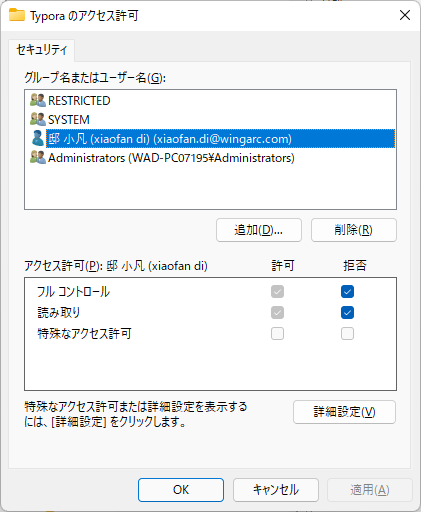

### 看电脑里装的所有软件

win+R打开注册表regedit

HKEY_LOCAL_MACHINE\SOFTWARE\Microsoft\Windows\CurrentVersion\Uninstall

导出成.reg文件

打开后搜索DisplayName，就是电脑里装的所有软件。

### Tomcat端口被占用问题

1.启动cmd

2.执行命令此处端口号为默认的8080） 目前项目中为3001

`netstat -ano|findstr 8080`

3.以步骤2的执行结果中的PID（【LISTENING】对应的值）为参数执行命令（此处以6160为例）

`taskkill /pid 6160 /f`	

### Typora过期问题

win+R打开注册表regedit

コンピューター\HKEY_CURRENT_USER\Software\Typora

 

### 删除浏览器session

 