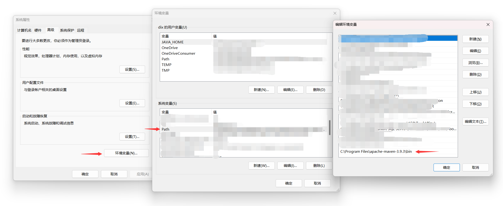
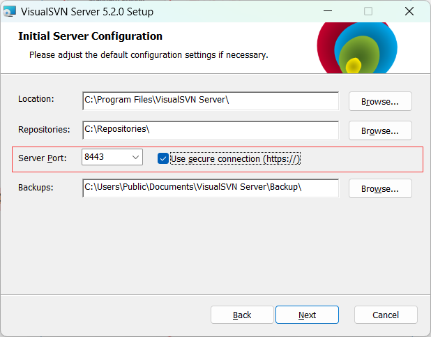

## 安装docker desktop

https://hub.docker.com/


### 安装linux

以及 旧版 WSL 的手动安装步骤

https://learn.microsoft.com/zh-cn/windows/wsl/install-manual

```
sudo -i
```

**※**一定不要忘了这个，确保是root@xxx下执行命令


### 更新APT库

E: Package 'git' has no installation candidate情况

没有更新APT库，更新一下就好了

```
sudo apt-get update 

sudo apt-get upgrade
```


### rpm安装

```
sudo apt install rpm
```


### yum安装

(Ubuntu可能不适应，可以直接跳过yum安装)

```
sudo apt-get install build-essential

sudo apt-get install yum
```

或

```
rpm -qa |grep yum
```

更新：

```
sudo yum update -y
```


### 安装aptitude

```
apt install aptitude
```


### 安装docker.io

并修复相关依赖包

```
aptitude install docker.io
```


在WSL中[安装Docker](https://so.csdn.net/so/search?q=安装Docker&spm=1001.2101.3001.7020)要使用命令：（这个好像也不行）

```
curl https://get.docker.com | sh
1
```

即原生linux docker，若使用以下命令安装则会提示unrecognized service。。。

```
sudo apt -y install docker.io
```


Using default tag: latest
Cannot connect to the Docker daemon at unix:///var/run/docker.sock. Is the docker daemon running?


### 安装systemctl

```text
sudo apt install systemctl
```


### docker确认安装

```ruby
ps -ef | grep docker
```


### 卸载docker

```
sudo apt autoremove docker
```


### docker查看版本

```
docker -v
```


### 基于docker安装InfluxDB（TODO）

启动docker：（没成功）

```
systemctl start docker
```

下载InfluxDB的镜像：

```
docker pull influxdb:1.8
```


## 安装Maven

### 官网

下载 apache-maven-x.x.x-bin.zip https://maven.apache.org/download.cgi

### 环境变量

环境变量 -> 编辑 系统变量 -> 新建 粘贴maven/bin位置

cmd输入 `mvn -v` 查看maven版本

 

### 目录

  - bin：存放了 maven 的命令

  - boot：存放了一些 maven 本身的引导程序，如类加载器等

  - conf：存放了 maven 的一些配置文件，如 setting.xml 文件

  - lib：存放了 maven 本身运行所需的一些 jar 包

### 注意

maven依赖 JAVA_HOME


## Redis

window安装，github官方下载包：

https://github.com/MSOpenTech/redis/tags

### 目录结构

| 目录或文件         | 作用                              |
| ------------------ | --------------------------------- |
| redis-benchmark    | 性能测试工具                      |
| redis-check-aof    | AOF文件修复工具                   |
| redis-check-dump   | RDB文件检查工具（快照持久化文件） |
| redis-cli          | 命令行客户端                      |
| redis-server       | redis服务器启动命令               |
| redis.windows.conf | redis核心配置文件                 |

### 启动

redis-server.exe：启动redis服务

redis-cli.exe：启动redis客户端


## SVN

### 安装

官网：

https://www.visualsvn.com/server/download/

### 端口

修改到8443

 
